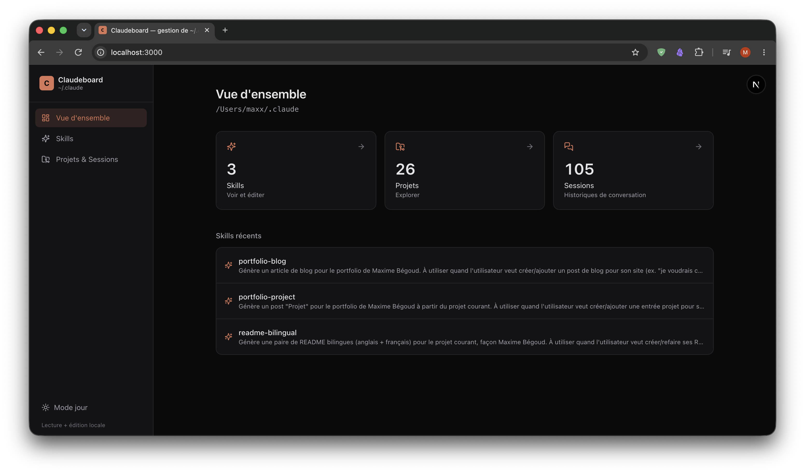
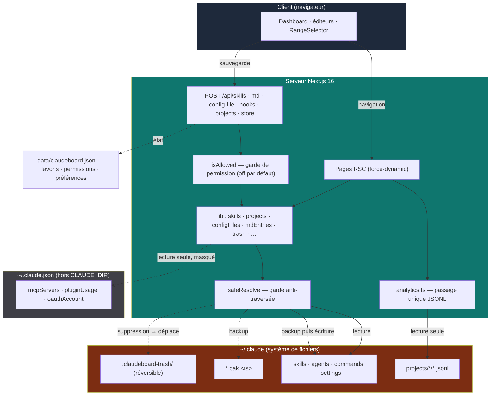

# claudeboard

<p align="center">
  <a href="./README.md"></a>
  &nbsp;
  <a href="./README.fr.md"></a>
</p>

Un dashboard **local** pour analyser, parcourir et éditer la configuration Claude Code stockée dans `~/.claude`.

Construit avec **Next.js 16** (App Router, React Server Components) et **React 19**. Il lit directement le système de fichiers de la machine — **il n'est pas destiné à être déployé** : pas de télémétrie, pas d'auth, tourne uniquement en localhost. La page d'accueil agrège tous les transcripts de conversation en un **seul passage** (`lib/analytics.ts` → `getAnalytics`) en KPI, panneau d'activité (heatmap / courbe de messages + streak), répartition tokens/coût par modèle et coût estimé. Skills, agents, commandes, hooks et fichiers de config peuvent être édités, créés et supprimés sur place — mais **toute écriture est conditionnée par une permission opt-in** (tout est désactivé par défaut : l'app démarre en lecture seule intégrale). Chaque écriture crée d'abord un backup horodaté `.bak`, et chaque suppression est **réversible** (déplacée en corbeille, jamais effacée) ; serveurs MCP et plugins restent strictement **en lecture seule**. Tout accès fichier passe par une garde `safeResolve` qui maintient les chemins à l'intérieur de `~/.claude` pour empêcher une traversée de répertoire depuis un slug d'URL.

> 🔒 **100 % local — rien ne quitte jamais votre machine.** claudeboard ne fait **aucun appel réseau** avec vos données : pas de télémétrie, pas d'analytics, pas de phone-home, pas d'API externe, pas de cloud. **Absolument tout reste sur votre disque.** Il ne lit et n'écrit que des fichiers locaux sous `~/.claude`, et le serveur est lié à `localhost`. Le seul accès réseau est `npm install` (récupération des dépendances) — jamais vos transcripts, votre config ni votre usage.

> ⚠️ **Non affilié à Anthropic.** claudeboard est un projet indépendant et communautaire. Il n'est ni approuvé par, ni lié à Anthropic d'aucune manière — « Claude » n'est mentionné que pour décrire ce que l'outil lit.

> 💡 **Pourquoi ce projet ?** Claude Code éparpille sa config dans `~/.claude` — les skills en fichiers `SKILL.md`, les transcripts de conversation en `.jsonl` bruts, les settings, hooks, agents, plugins. claudeboard transforme ce dossier opaque en un dashboard navigable et éditable — avec de vraies analytics d'usage — sans jamais quitter votre machine.

> 📥 **Source des données.** Les transcripts lus par claudeboard proviennent **uniquement** de Claude Code lui-même : le **CLI** (`entrypoint: cli`) et l'**extension VS Code** (`entrypoint: claude-vscode`), qui écrivent tous deux dans `~/.claude/projects/*/*.jsonl`. Rien d'autre n'est inclus — ni claude.ai (web), ni l'app Claude Desktop, ni l'usage API brut.



## Stack

| Couche | Technologie |
|---|---|
| Framework | Next.js 16 — App Router, RSC par défaut, pages FS en `force-dynamic` |
| UI | React 19, TypeScript (strict), alias d'import `@/*` |
| Styling | Tailwind CSS v4 (`@tailwindcss/postcss`, pas de `tailwind.config`) |
| Frontmatter | `gray-matter` (parse/serialize YAML) |
| Markdown | `react-markdown` + `remark-gfm` |
| Icônes | `lucide-react` |

## Structure

```
claudeboard/
├── lib/
│   ├── claude.ts          # CLAUDE_DIR + safeResolve (garde anti-traversée) + formatage date/taille/durée
│   ├── analytics.ts       # getAnalytics : un seul passage JSONL → totaux, heatmap, tokens/coût par modèle,
│   │                       #   top outils, coût par projet, heures de session, streak, vélocité N vs N-1 · PRICING
│   ├── store.ts           # état claudeboard dans data/claudeboard.json (favoris, overrides de tarifs,
│   │                       #   abonnement, permissions, préférences) · PERMISSION_SCHEMA · isAllowed
│   ├── skills.ts          # list/get/write/create/deleteSkill (backup .bak avant écrasement)
│   ├── projects.ts        # listProjects · listSessions · getSession · normalisation des blocs JSONL
│   ├── mdEntries.ts       # agents & commandes : list/get/write/create/delete (.md, slugs imbriqués = namespaces)
│   ├── configFiles.ts     # read/write/reset/deleteConfigFile : settings, CLAUDE.md, keybindings (validé, backup)
│   ├── hooks.ts           # getHooks (groupés par event) · getHooksRaw/writeHooks (bloc hooks de settings.json)
│   ├── trash.ts           # moveToTrash : suppressions réversibles → CLAUDE_DIR/.claudeboard-trash/
│   ├── favorites.ts       # getFavoriteSessions : résout les clés de favoris en métadonnées de session
│   ├── mcp.ts             # getMcpServers : lecture seule de ~/.claude.json, valeurs d'env masquées
│   ├── plugins.ts         # getPlugins : lecture seule du catalogue marketplaces/plugins
│   ├── subscription.ts    # getSubscription : lecture seule du plan Claude (champs non sensibles)
│   ├── keybindings.ts     # parseKeybindings : extraction défensive pour l'aperçu tabulaire
│   └── docs.ts            # listDocs · getDoc : rend les fichiers .md de docs/ sur /docs
├── app/
│   ├── page.tsx           # Dashboard analytics (KPI, panneau d'activité, modèles, coût, RangeSelector)
│   ├── skills/            # liste · [name] (détail + éditeur)
│   ├── projects/          # liste · [id] (sessions) · [id]/[session] (transcript)
│   ├── config/            # preferences (permissions + tarifs + abonnement) · settings · hooks ·
│   │                       #   claude-md · agents · commands · mcp · plugins · keybindings · directory
│   ├── docs/              # layout · page · [slug] (rend docs/*.md)
│   ├── api/               # skills · md · config-file · hooks · projects (écritures gated) · store (état claudeboard)
│   └── layout.tsx · globals.css · icon.svg
├── components/            # Sidebar · Markdown · ConfigEditor · PermissionsMatrix · ActivityPanel ·
│                           #   ModelDonut · RangeSelector · SubscriptionCard · CostStatCard · DocsNav · …
├── docs/                  # doc projet bilingue (.md) — même source rendue sur /docs
└── AGENTS.md              # instructions projet (aliasé par CLAUDE.md)
```

## Fonctionnalités

- **Dashboard analytics (`/`)** — agrège tous les transcripts JSONL en un seul passage : KPI (projets, sessions, messages, tokens, coût estimé), un **panneau d'activité** (`ActivityPanel`) qui bascule entre une heatmap sur 12 mois et une courbe des messages par jour avec un **streak** de jours consécutifs, camembert des modèles (`ModelDonut`) avec comptes IN/OUT, tokens & coût par modèle, coût par projet, distribution horaire des débuts de session (heure locale), outils/skills les plus utilisés, sessions épinglées et stats de session. Un `RangeSelector` filtre la fenêtre (tout / 30 j / 7 j / un mois donné / une plage libre) ; les KPI concernés affichent un **delta de vélocité** vs la période précédente de même durée (N vs N-1). La carte KPI **Coût** cliquable (`CostStatCard`) bascule entre coût d'usage estimé et économie nette d'abonnement ; une `SubscriptionCard` compare le coût d'usage au prix de votre plan Claude.
- **Autorisations d'écriture** — toute mutation de `~/.claude` est conditionnée par une **permission opt-in** (ressource × action, `PERMISSION_SCHEMA` dans `lib/store.ts`). **Tout est `false` par défaut** : l'app démarre en lecture seule intégrale ; vous ouvrez ce que vous autorisez depuis **Préférences → Autorisations d'écriture** (`PermissionsMatrix`). Le contrôle d'accès est fait **côté serveur** (`isAllowed` → `403`) ; l'UI ne fait que le refléter.
- **Skills (`/skills`)** — liste, aperçu, **édition**, **création** et **suppression** de chaque `~/.claude/skills/*/SKILL.md` (frontmatter YAML + corps markdown). Chaque sauvegarde écrit un `SKILL.md.bak.<timestamp>` horodaté avant d'écraser ; les suppressions déplacent le dossier en corbeille.
- **Projets & Sessions (`/projects`)** — navigation **en lecture seule** des transcripts `~/.claude/projects/*/*.jsonl`, chaque ligne normalisée en blocs `text`, `thinking`, `tool_use` et `tool_result`. La page d'un projet affiche aussi ses stats agrégées (`getProjectStats`). Projets et sessions sont **épinglables** (`FavoriteButton`) ; un `ResumeButton` copie `claude --resume <id>` ; la suppression (corbeille) est possible avec `projects.delete`.
- **Config (`/config/*`)** — **Préférences** (réglages propres à claudeboard : autorisations d'écriture, tarifs d'estimation, abonnement, affichage de la carte de coût), **Settings** (édition de `settings.json` / `settings.local.json`, JSON validé live + backup, reset), **Hooks** (groupés par event, **édition** du bloc hooks de `settings.json`), **Agents** & **Commandes** (liste/aperçu/édition/création/suppression, sous-dossiers = namespaces), éditeur du **CLAUDE.md global** (création/reset/suppression), **serveurs MCP** (lecture seule, `env` masqué), **Plugins & Marketplaces** (lecture seule, l'installation reste dans le CLI), **Keybindings** (tableau + éditeur JSON, création/reset/suppression) et **Structure du dossier** (arbre `.claude` pédagogique).
- **Documentation (`/docs`)** — rend les fichiers `.md` de `docs/` avec un sommaire latéral, pour que la doc projet soit lisible aussi bien sur GitHub que dans l'app.
- **Thème** — bascule clair/sombre, persistée dans `localStorage` et appliquée avant le premier rendu (pas de flash).

## Variables d'environnement

L'app n'a besoin d'aucune configuration pour tourner. Copier `.env.example` en `.env` pour surcharger le défaut. Une seule variable optionnelle permet de la pointer vers un dossier Claude non standard (utile pour les tests) :

| Variable | Défaut | Description |
|---|---|---|
| `CLAUDE_DIR` | `~/.claude` | Racine de la config Claude Code à lire/éditer. Tout est confiné sous ce chemin. |

> 🔒 **Modèle de menace.** claudeboard lit et écrit votre système de fichiers local sans authentification. C'est un outil **localhost uniquement** — ne l'exposez pas sur un réseau et ne le déployez pas. Toute écriture est conditionnée par une **permission opt-in** appliquée côté serveur (`isAllowed` → `403` ; tout désactivé par défaut), toute suppression est **réversible** (déplacée vers `CLAUDE_DIR/.claudeboard-trash/`, jamais effacée), et l'état propre à claudeboard vit dans `data/claudeboard.json`, **hors** de `CLAUDE_DIR`. La traversée de répertoire depuis un slug d'URL est bloquée par `safeResolve` (tout doit se résoudre dans `CLAUDE_DIR`), et les API d'écriture refusent en plus les slugs de traversée et valident le frontmatter/JSON avant d'écrire. `lib/mcp.ts`, `lib/subscription.ts` et `lib/plugins.ts` lisent `~/.claude.json` (qui est hors de `CLAUDE_DIR` et contient des secrets) de façon **ciblée et en lecture seule** uniquement — les valeurs d'`env` sont masquées et jamais écrites.

## Développement

```bash
npm install
npm run dev        # démarre le dashboard en localhost
```

Pour le pointer vers un dossier Claude non standard (ou pour des tests) :

```bash
CLAUDE_DIR=/chemin/.claude npm run dev
```

Autres scripts :

```bash
npm run build      # build de production
npm run start      # sert le build de production
npm run lint       # ESLint (next lint)
```

## Architecture

- **Lectures** — `getAnalytics` scanne tous les transcripts JSONL en un **seul passage** pour construire chaque chiffre du dashboard ; les libs config/skills/projets lisent `~/.claude` à la demande. Toutes les pages qui touchent au FS déclarent `export const dynamic = "force-dynamic"` puisque les données changent hors du cycle de build.
- **Écritures** — skills, agents, commandes, hooks, fichiers de config et suppressions de projets/sessions passent par `POST /api/skills`, `/api/md`, `/api/config-file`, `/api/hooks` et `/api/projects` ; chacune est gated par `isAllowed(resource, action)` côté serveur (toutes les permissions désactivées par défaut). `writeSkill`/`writeMdEntry` refusent de créer un nouveau fichier (il doit déjà exister) et le copient toujours vers un `.bak` horodaté avant d'écraser ; la création de fichiers de config (`settings.local.json`, `keybindings.json`, `CLAUDE.md` global) est explicite ; les suppressions passent par `moveToTrash` (réversible). L'état propre à claudeboard (favoris, tarifs, abonnement, permissions, préférences) est écrit dans `data/claudeboard.json` via `POST /api/store`.
- **Sûreté** — chaque chemin dans `CLAUDE_DIR` est construit avec `safeResolve(...)`, qui lève une erreur si le résultat en sort. Les lectures seules de `~/.claude.json` (`mcp.ts`, `subscription.ts`, `plugins.ts`) sont les exceptions documentées, limitées à des champs non sensibles.
- **Note Next 16** — dans les pages, `params` est une **Promise** et doit être `await`é avant de lire `id`/`name`/`slug`/`session`.

## Schéma


