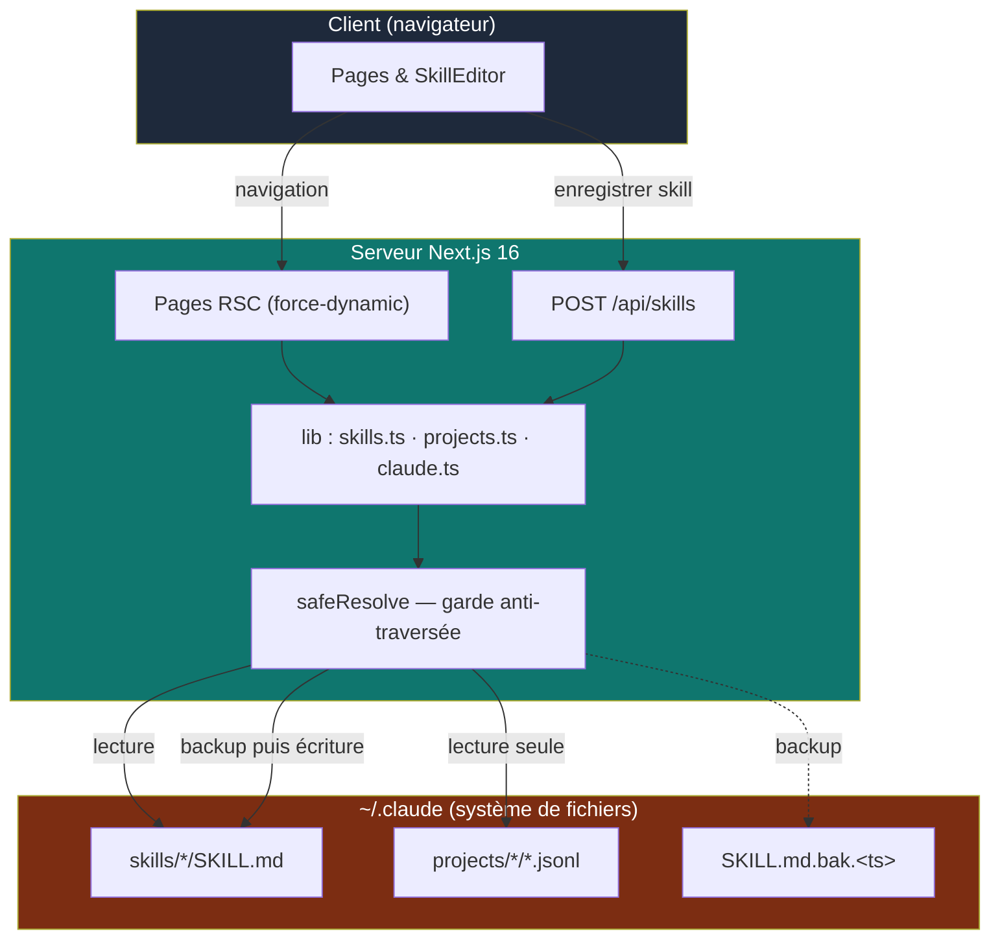

# claudeboard

<p align="center">
  <a href="./README.md"></a>
  &nbsp;
  <a href="./README.fr.md"></a>
</p>

Un dashboard **local** pour visualiser et éditer la configuration Claude Code stockée dans `~/.claude`.

Construit avec **Next.js 16** (App Router, React Server Components) et **React 19**. Il lit directement le système de fichiers de la machine — **il n'est pas destiné à être déployé** : pas de télémétrie, pas d'auth, tourne uniquement en local. Les skills sont édités sur place (chaque écriture crée d'abord un backup horodaté `.bak`) ; les projets et sessions sont strictement **en lecture seule**. Tout accès fichier passe par une garde `safeResolve` qui maintient les chemins à l'intérieur de `~/.claude` pour empêcher toute traversée de répertoire depuis un slug d'URL.

> ⚠️ **Sans lien avec Anthropic.** claudeboard est un projet indépendant et communautaire. Il n'est ni approuvé par ni rattaché à Anthropic — « Claude » n'est mentionné que pour décrire ce que l'outil lit.

> 💡 **Pourquoi ce projet ?** Claude Code éparpille sa config dans `~/.claude` — les skills sous forme de fichiers `SKILL.md`, les transcripts de conversation en `.jsonl` bruts. claudeboard transforme ce répertoire opaque en un dashboard navigable et éditable, sans jamais quitter votre machine.


## Stack

| Couche | Technologie |
|---|---|
| Framework | Next.js 16 — App Router, RSC par défaut, pages `force-dynamic` |
| UI | React 19, TypeScript (strict), alias d'import `@/*` |
| Styles | Tailwind CSS v4 (`@tailwindcss/postcss`, pas de `tailwind.config`) |
| Frontmatter | `gray-matter` (parse/sérialisation YAML) |
| Markdown | `react-markdown` + `remark-gfm` |
| Icônes | `lucide-react` |

## Structure

```
claudeboard/
├── lib/
│   ├── claude.ts               # CLAUDE_DIR + safeResolve (garde anti-traversée) + formateurs date/taille
│   ├── skills.ts               # listSkills · getSkill · writeSkill (backup .bak avant écrasement)
│   └── projects.ts             # listProjects · listSessions · getSession · normalisation des blocs JSONL
├── app/
│   ├── page.tsx                # Vue d'ensemble (compteurs + skills récents)
│   ├── skills/page.tsx         # Liste des skills
│   ├── skills/[name]/page.tsx  # Détail + éditeur d'un skill
│   ├── projects/page.tsx       # Liste des projets
│   ├── projects/[id]/page.tsx  # Sessions d'un projet
│   ├── projects/[id]/[session]/page.tsx   # Transcript d'une session
│   ├── api/skills/route.ts     # POST { slug, raw } → écrit le SKILL.md (validations d'abord)
│   ├── layout.tsx · globals.css · icon.svg
├── components/
│   ├── Sidebar · Markdown · Collapsible
│   ├── ConfirmDialog · SkillEditor · ThemeToggle
└── AGENTS.md                   # instructions du projet (aliasé par CLAUDE.md)
```

## Fonctionnalités

- **Vue d'ensemble (`/`)** — compteurs de skills, projets et sessions, plus les skills édités le plus récemment.
- **Liste des skills (`/skills`)** — chaque `~/.claude/skills/*/SKILL.md` avec son `name` et sa `description` extraits du frontmatter.
- **Éditeur de skill (`/skills/[name]`)** — aperçu et **édition** du `SKILL.md` brut (frontmatter YAML + corps markdown). L'enregistrement poste vers l'API, qui valide le frontmatter et écrit un `SKILL.md.bak.<timestamp>` horodaté à côté du fichier avant d'écraser.
- **Liste des projets (`/projects`)** — chaque dossier `~/.claude/projects/*`, résolu vers son vrai `cwd` en scannant la première session, avec le nombre de sessions et la date de dernière modification.
- **Sessions (`/projects/[id]`)** — les transcripts `.jsonl` d'un projet, avec titre IA, nombre de messages et taille.
- **Transcript (`/projects/[id]/[session]`)** — rendu **en lecture seule** d'une conversation, chaque ligne JSONL normalisée en blocs `text`, `thinking`, `tool_use` et `tool_result`.
- **Bascule de thème** — commutateur clair/sombre.

## Variables d'environnement

L'app ne nécessite aucune configuration pour tourner. Copiez `.env.example` en `.env` pour surcharger le défaut. Une seule variable optionnelle permet de la pointer vers un répertoire Claude non standard (utile pour les tests) :

| Variable | Défaut | Description |
|---|---|---|
| `CLAUDE_DIR` | `~/.claude` | Racine de la config Claude Code à lire/éditer. Tout est cantonné sous ce chemin. |

> 🔒 **Modèle de menace.** claudeboard lit et écrit votre système de fichiers local sans authentification. C'est un outil **local uniquement** — ne l'exposez pas sur un réseau et ne le déployez pas. La traversée de répertoire depuis les slugs d'URL est bloquée par `safeResolve` (tout doit se résoudre à l'intérieur de `CLAUDE_DIR`), et `/api/skills` refuse en plus les slugs contenant `/` ou `..` et refuse d'écrire lorsque le frontmatter n'est pas parsable.

## Développement

```bash
npm install
npm run dev        # démarre le dashboard en local
```

Pour pointer vers un répertoire Claude non standard (ou pour des tests) :

```bash
CLAUDE_DIR=/chemin/.claude npm run dev
```

Autres scripts :

```bash
npm run build      # build de production
npm run start      # sert le build de production
npm run lint       # ESLint (next lint)
```

## Architecture

- **Lecture** — `lib/skills.ts` et `lib/projects.ts` lisent `~/.claude` à chaque requête ; toutes les pages qui touchent le FS déclarent `export const dynamic = "force-dynamic"` car les données changent hors du cycle de build.
- **Écriture** — seuls les skills sont modifiables, via `POST /api/skills`. `writeSkill` refuse de créer un nouveau fichier (le `SKILL.md` doit déjà exister) et le copie toujours vers `SKILL.md.bak.<timestamp>` avant d'écraser.
- **Sécurité** — chaque chemin est construit avec `safeResolve(...)`, qui résout contre `CLAUDE_DIR` et lève une erreur si le résultat en sort.
- **Note Next 16** — dans les pages, `params` est une **Promise** et doit être `await`é avant de lire `id`/`name`/`session`.

## Schéma


