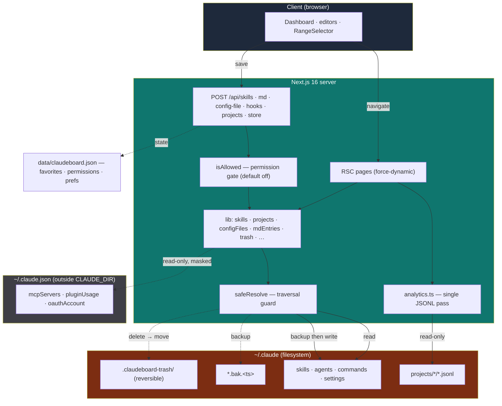

# claudeboard

<p align="center">
  <a href="./README.md"></a>
  &nbsp;
  <a href="./README.fr.md"></a>
</p>

A **local** dashboard to analyze, browse and edit the Claude Code configuration stored in `~/.claude`.

<p align="center">
  <video src="https://github.com/user-attachments/assets/14018ef7-d160-4485-85fa-21c500fea2e8" controls muted></video>
</p>

> 🔒 **100% local — nothing ever leaves your machine.** claudeboard makes **zero network calls** with your data: no telemetry, no analytics, no external API, no cloud. **Absolutely everything stays on your disk.** It has read-only access to `~/.claude`, and read-write access to the project directory.

Built with **Next.js 16** and **React 19**, it reads `~/.claude` on the machine directly — **it is not meant to be deployed**: no telemetry, runs on localhost only. The home page brings all your conversation transcripts together in one clear dashboard: KPIs (projects, sessions, messages, tokens, estimated cost), an activity panel (heatmap and message curve with streak), and per-model token and cost breakdowns. Skills, agents, commands, hooks and config files can be viewed, edited, created and deleted straight from the app — but **every write is gated by an opt-in permission**: everything is off by default, so the app starts fully read-only. Every change makes a timestamped backup and every delete is **reversible** (moved to the trash, never erased); MCP servers and plugins stay strictly **read-only**.

📥 **Data source:** The transcripts shown come **only** from Claude Code: the **CLI** and the **VS Code extension**, both of which write to `~/.claude/projects/`. Nothing else is included — not claude.ai (web), not the Claude Desktop app, not raw API usage.

> ⚠️ **Not affiliated with Anthropic.** claudeboard is an independent, community project. It is not endorsed by or connected to Anthropic in any way — "Claude" is referenced only to describe what the tool reads.

## Stack

| Layer | Technology |
|---|---|
| Framework | Next.js 16 — App Router, RSC by default, `force-dynamic` FS pages |
| UI | React 19, TypeScript (strict), import alias `@/*` |
| Styling | Tailwind CSS v4 (`@tailwindcss/postcss`, no `tailwind.config`) |
| Frontmatter | `gray-matter` (YAML parse/serialize) |
| Markdown | `react-markdown` + `remark-gfm` |
| Icons | `lucide-react` |

## Structure

```
claudeboard/
├── lib/
│   ├── claude.ts          # CLAUDE_DIR + safeResolve (traversal guard) + date/size/duration formatters
│   ├── analytics.ts       # getAnalytics: single JSONL pass → totals, heatmap, per-model tokens/cost,
│   │                       #   top tools, cost per project, session hours, streak, N-vs-N-1 velocity · PRICING
│   ├── store.ts           # claudeboard state in data/claudeboard.json (favorites, pricing overrides,
│   │                       #   subscription, permissions, prefs) · PERMISSION_SCHEMA · isAllowed
│   ├── skills.ts          # list/get/write/create/deleteSkill (.bak backup before overwrite)
│   ├── projects.ts        # listProjects · listSessions · getSession · JSONL block normalization
│   ├── mdEntries.ts       # agents & commands: list/get/write/create/delete (.md, nested slugs = namespaces)
│   ├── configFiles.ts     # read/write/reset/deleteConfigFile: settings, CLAUDE.md, keybindings (validated, backup)
│   ├── hooks.ts           # getHooks (grouped by event) · getHooksRaw/writeHooks (settings.json hooks block)
│   ├── trash.ts           # moveToTrash: reversible deletes → CLAUDE_DIR/.claudeboard-trash/
│   ├── favorites.ts       # getFavoriteSessions: resolves favorite keys to session metadata
│   ├── mcp.ts             # getMcpServers: read-only ~/.claude.json, env values masked
│   ├── plugins.ts         # getPlugins: read-only marketplaces/plugins catalog
│   ├── subscription.ts    # getSubscription: read-only Claude plan (non-sensitive fields)
│   ├── keybindings.ts     # parseKeybindings: defensive extraction for the table preview
│   └── docs.ts            # listDocs · getDoc: renders the .md files under docs/ on /docs
├── app/
│   ├── page.tsx           # Analytics dashboard (KPIs, activity panel, models, cost, RangeSelector)
│   ├── skills/            # list · [name] (detail + editor)
│   ├── projects/          # list · [id] (sessions) · [id]/[session] (transcript)
│   ├── config/            # preferences (permissions + pricing + subscription) · settings · hooks ·
│   │                       #   claude-md · agents · commands · mcp · plugins · keybindings · directory
│   ├── docs/              # layout · page · [slug] (renders docs/*.md)
│   ├── api/               # skills · md · config-file · hooks · projects (gated writes) · store (claudeboard state)
│   └── layout.tsx · globals.css · icon.svg
├── components/            # Sidebar · Markdown · ConfigEditor · PermissionsMatrix · ActivityPanel ·
│                           #   ModelDonut · RangeSelector · SubscriptionCard · CostStatCard · DocsNav · …
├── docs/                  # bilingual project docs (.md) — same source rendered on /docs
└── AGENTS.md              # project instructions (aliased by CLAUDE.md)
```

## Features

- **Analytics dashboard (`/`)** — aggregates every JSONL transcript in one pass: KPIs (projects, sessions, messages, tokens, estimated cost), an **activity panel** (`ActivityPanel`) toggling between a 12-month heatmap and a per-day message curve with a consecutive-day **streak**, a model donut (`ModelDonut`) with IN/OUT counts, tokens & cost per model, cost per project, an hourly distribution of session starts (local time), most-used tools/skills, pinned sessions, and session stats. A `RangeSelector` filters the window (all / 30d / 7d / a given month / a custom range); the relevant KPIs show a **velocity delta** vs the previous period of equal length (N vs N-1). The clickable **Cost** KPI (`CostStatCard`) toggles between estimated usage cost and net subscription savings; a `SubscriptionCard` compares usage cost against your Claude plan price.
- **Write permissions** — every mutation of `~/.claude` is gated by an **opt-in permission** (resource × action, `PERMISSION_SCHEMA` in `lib/store.ts`). **Everything is `false` by default**, so the app starts fully read-only; you open what you allow from **Preferences → Write permissions** (`PermissionsMatrix`). Access control is enforced **server-side** (`isAllowed` → `403`); the UI only reflects it.
- **Skills (`/skills`)** — list, preview, **edit**, **create** and **delete** each `~/.claude/skills/*/SKILL.md` (YAML frontmatter + markdown body). Every save writes a timestamped `SKILL.md.bak.<timestamp>` before overwriting; deletes move the folder to the trash.
- **Projects & Sessions (`/projects`)** — **read-only** navigation of `~/.claude/projects/*/*.jsonl` transcripts, each line normalized into `text`, `thinking`, `tool_use` and `tool_result` blocks. A project page also shows its aggregated stats (`getProjectStats`). Projects and sessions are **pinnable** (`FavoriteButton`); a `ResumeButton` copies `claude --resume <id>`; deletion (trash) is available with `projects.delete`.
- **Config (`/config/*`)** — **Preferences** (claudeboard's own settings: write permissions, estimation pricing, subscription, cost-card display), **Settings** (edit `settings.json` / `settings.local.json`, live-validated + backup, reset), **Hooks** (grouped by event, **editable** hooks block of `settings.json`), **Agents** & **Commands** (list/preview/edit/create/delete, nested folders = namespaces), **global CLAUDE.md** editor (create/reset/delete), **MCP servers** (read-only, `env` masked), **Plugins & Marketplaces** (read-only, install stays in the CLI), **Keybindings** (table + JSON editor, create/reset/delete) and **Directory** (educational `.claude` tree).
- **Documentation ([`/docs`](https://github.com/maximebgd/claudeboard/tree/main/docs))** — renders the `.md` files under `docs/` with a side table of contents, so the project docs are readable both on GitHub and in the app.
- **Theme** — light/dark toggle, persisted in `localStorage` and applied before first paint (no flash).

## Security

claudeboard is **localhost-only by design**. The Next.js server binds to `localhost` (`127.0.0.1`), so the dashboard is reachable **only from your own machine** — never from your local network, never from the internet. The app is **not meant to be deployed**. Combined with the opt-in write permissions (all off by default) and reversible, backed-up writes, this keeps your Claude Code config fully under your control and entirely on your disk.

## Environment variables

The app needs no configuration to run. Copy `.env.example` to `.env` if you want to override the default. A single optional variable lets you point it at a non-standard Claude directory (useful for tests):

| Variable | Default | Description |
|---|---|---|
| `CLAUDE_DIR` | `~/.claude` | Root of the Claude Code config to read/edit. Everything is sandboxed under this path. |

## Development

```bash
npm install
npm run dev        # start the dashboard on localhost
```

Point it at a non-standard Claude directory (or for tests):

```bash
CLAUDE_DIR=/path/.claude npm run dev
```

Other scripts:

```bash
npm run build      # production build
npm run start      # serve the production build
npm run lint       # ESLint (next lint)
```

## Architecture

- **Reads** — `getAnalytics` scans all JSONL transcripts in a **single pass** to build every dashboard figure; the config/skills/projects libs read `~/.claude` on demand. All pages that touch the FS declare `export const dynamic = "force-dynamic"` since the data changes outside the build cycle.
- **Writes** — skills, agents, commands, hooks, config files and project/session deletes go through `POST /api/skills`, `/api/md`, `/api/config-file`, `/api/hooks` and `/api/projects`; each is gated by `isAllowed(resource, action)` server-side (all permissions off by default). `writeSkill`/`writeMdEntry` refuse to create a new file (it must already exist) and always copy it to a timestamped `.bak` before overwriting; config-file creation (`settings.local.json`, `keybindings.json`, global `CLAUDE.md`) is explicit; deletes go through `moveToTrash` (reversible). claudeboard's own state (favorites, pricing, subscription, permissions, prefs) is written to `data/claudeboard.json` via `POST /api/store`.
- **Safety** — every path inside `CLAUDE_DIR` is built with `safeResolve(...)`, which throws if the result escapes it. The read-only reads of `~/.claude.json` (`mcp.ts`, `subscription.ts`, `plugins.ts`) are the documented exceptions, scoped to non-sensitive fields.
- **Next 16 note** — in pages, `params` is a **Promise** and must be `await`ed before reading `id`/`name`/`slug`/`session`.

## Schema


