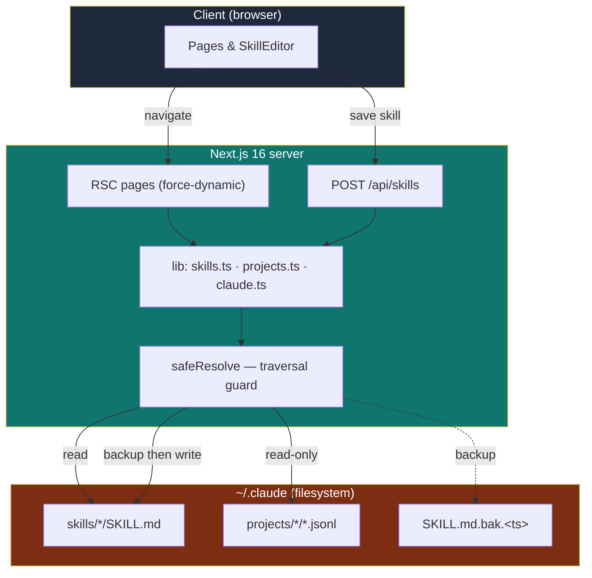

# claudeboard

<p align="center">
  <a href="./README.md"></a>
  &nbsp;
  <a href="./README.fr.md"></a>
</p>

A **local** dashboard to browse and edit the Claude Code configuration stored in `~/.claude`.

Built with **Next.js 16** (App Router, React Server Components) and **React 19**. It reads the machine's filesystem directly — **it is not meant to be deployed**: no telemetry, no auth, runs on localhost only. Skills are edited in place (every write creates a timestamped `.bak` backup first); projects and sessions are strictly **read-only**. Every filesystem access goes through a `safeResolve` guard that keeps paths inside `~/.claude` to prevent directory traversal from a URL slug.

> ⚠️ **Not affiliated with Anthropic.** claudeboard is an independent, community project. It is not endorsed by or connected to Anthropic in any way — "Claude" is referenced only to describe what the tool reads.

> 💡 **Why this project?** Claude Code scatters its config across `~/.claude` — skills as `SKILL.md` files, conversation transcripts as raw `.jsonl`. claudeboard turns that opaque directory into a browsable, editable dashboard without ever leaving your machine.

> 📥 **Data source.** The transcripts read by claudeboard come **only** from Claude Code itself: the **CLI** (`entrypoint: cli`) and the **VS Code extension** (`entrypoint: claude-vscode`), both of which write to `~/.claude/projects/*/*.jsonl`. Nothing else is included — not claude.ai (web), not the Claude Desktop app, not raw API usage.


## Stack

| Layer | Technology |
|---|---|
| Framework | Next.js 16 — App Router, RSC by default, `force-dynamic` pages |
| UI | React 19, TypeScript (strict), import alias `@/*` |
| Styling | Tailwind CSS v4 (`@tailwindcss/postcss`, no `tailwind.config`) |
| Frontmatter | `gray-matter` (YAML parse/serialize) |
| Markdown | `react-markdown` + `remark-gfm` |
| Icons | `lucide-react` |

## Structure

```
claudeboard/
├── lib/
│   ├── claude.ts               # CLAUDE_DIR + safeResolve (traversal guard) + date/size formatters
│   ├── skills.ts               # listSkills · getSkill · writeSkill (.bak backup before overwrite)
│   └── projects.ts             # listProjects · listSessions · getSession · JSONL block normalization
├── app/
│   ├── page.tsx                # Overview (counters + recent skills)
│   ├── skills/page.tsx         # Skills list
│   ├── skills/[name]/page.tsx  # Skill detail + editor
│   ├── projects/page.tsx       # Projects list
│   ├── projects/[id]/page.tsx  # Sessions of a project
│   ├── projects/[id]/[session]/page.tsx   # Session transcript
│   ├── api/skills/route.ts     # POST { slug, raw } → writes SKILL.md (validates first)
│   ├── layout.tsx · globals.css · icon.svg
├── components/
│   ├── Sidebar · Markdown · Collapsible
│   ├── ConfirmDialog · SkillEditor · ThemeToggle
└── AGENTS.md                   # project instructions (aliased by CLAUDE.md)
```

## Features

- **Overview (`/`)** — counters for skills, projects and sessions, plus the most recently edited skills.
- **Skills list (`/skills`)** — every `~/.claude/skills/*/SKILL.md` with its `name` and `description` pulled from the frontmatter.
- **Skill editor (`/skills/[name]`)** — preview and **edit** the raw `SKILL.md` (YAML frontmatter + markdown body). Saving posts to the API, which validates the frontmatter and writes a timestamped `SKILL.md.bak.<timestamp>` next to the file before overwriting.
- **Projects list (`/projects`)** — each `~/.claude/projects/*` folder, resolved to its real `cwd` by scanning the first session, with session count and last-modified date.
- **Sessions (`/projects/[id]`)** — the `.jsonl` transcripts of a project, with AI title, message count and size.
- **Transcript (`/projects/[id]/[session]`)** — **read-only** render of a conversation, each JSONL line normalized into `text`, `thinking`, `tool_use` and `tool_result` blocks.
- **Theme toggle** — light/dark switch.

## Environment variables

The app needs no configuration to run. Copy `.env.example` to `.env` if you want to override the default. A single optional variable lets you point it at a non-standard Claude directory (useful for tests):

| Variable | Default | Description |
|---|---|---|
| `CLAUDE_DIR` | `~/.claude` | Root of the Claude Code config to read/edit. Everything is sandboxed under this path. |

> 🔒 **Threat model.** claudeboard reads and writes your local filesystem with no authentication. It is a **localhost-only** tool — do not expose it on a network or deploy it. Path traversal from URL slugs is blocked by `safeResolve` (everything must resolve inside `CLAUDE_DIR`), and `/api/skills` additionally rejects slugs containing `/` or `..` and refuses to write when the frontmatter is unparsable.

## Development

```bash
npm install
npm run dev        # start the dashboard on localhost
```

Point it at a non-standard Claude directory (or for tests):

```bash
CLAUDE_DIR=/path/.claude npm run dev
```

Other scripts:

```bash
npm run build      # production build
npm run start      # serve the production build
npm run lint       # ESLint (next lint)
```

## Architecture

- **Reads** — `lib/skills.ts` and `lib/projects.ts` read `~/.claude` on every request; all pages that touch the FS declare `export const dynamic = "force-dynamic"` since the data changes outside the build cycle.
- **Writes** — only skills are writable, through `POST /api/skills`. `writeSkill` refuses to create a new file (the `SKILL.md` must already exist) and always copies it to `SKILL.md.bak.<timestamp>` before overwriting.
- **Safety** — every path is built with `safeResolve(...)`, which resolves against `CLAUDE_DIR` and throws if the result escapes it.
- **Next 16 note** — in pages, `params` is a **Promise** and must be `await`ed before reading `id`/`name`/`session`.

## Schema


